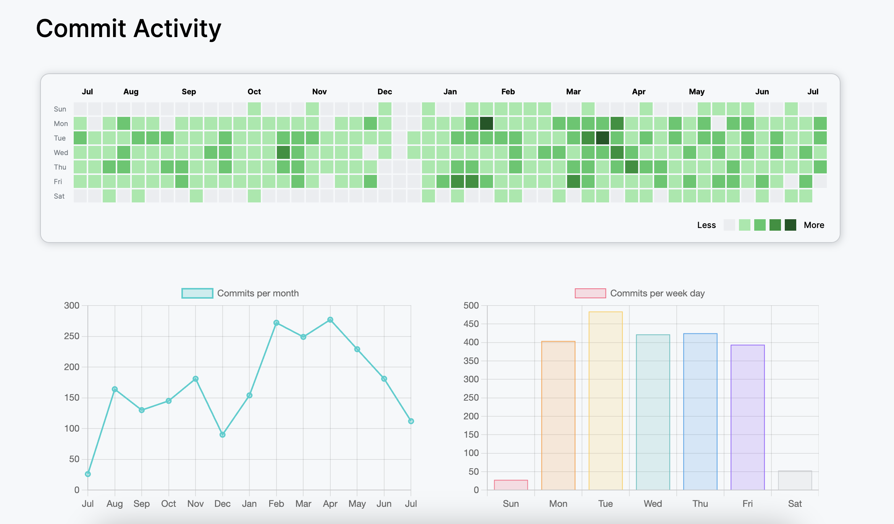
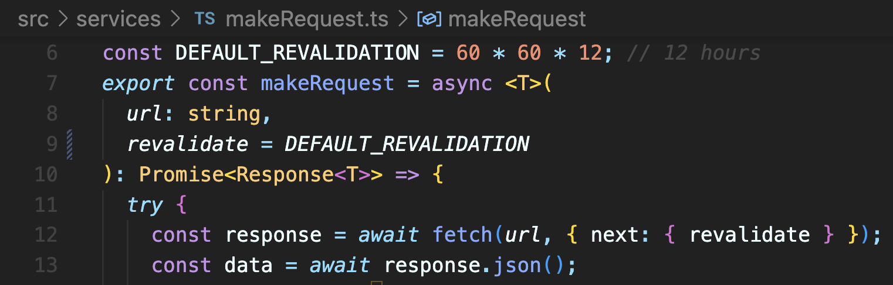

## Commit Activity

This project displays data and statistics about commit activity based on a given Github API endpoint.
You can find a live version of the project at:

https://commit-activity.vercel.app/



### Technologies and decisions

For this project, I used Next.js as the primary framework. Next.js is an excellent tool for building React applications due to its ease of setup and use. Although Next.js offers a range of powerful features, many of which were not utilized in this project, I think the most useful capability in this case was the `Incremental static regeneration`. This feature enabled me to fetch data from the GitHub API only twice a day (or less, depending on specific requirements and use cases) and serve static pages to users. This approach significantly enhances the website's performance. Setting it up was straightforward, requiring only the addition of a `revalidate` property to my fetch request. This configuration was implemented in the `makeRequest` component:



<br>

For styling, I leveraged CSS modules, a feature built into Next.js. CSS modules allow me to write component-scoped CSS code, eliminating concerns about class conflicts with other components. For the main graph, I opted to use plain CSS, as it was straightforward to implement using a styled HTML table. Additionally, I incorporated charts to display key statistics, providing a faster way to interpret the data compared to the initial graph. To achieve this, I utilized the Chart.js library, which facilitated the creation of complex charts with minimal effort.

### Prerequisites

To run this project, you will need to have Node.js and NPM installed on your machine. You can download them [here](https://nodejs.org/en/download/).

As this is a Next.js project, you will need Node.js version `18.17.0` or higher, and NPM version `9.6.7` or higher.

### Setting up the project

1. Clone the repository

```bash
git clone https://github.com/mateofay2099/commit-activity.git
```

2. Navigate to the project directory

```bash
cd commit-activity
```

3. Install the dependencies

```bash
npm install
```

4. Create a `.env.local` file in the root of the project and set the ENDPOINT_URL environment variable to the Github API endpoint you want to use. You can use `.env.example` as a template. You only need to replace the :owner and :repo values. For more information about this endpoint, you can visit the [Github API Docs](https://docs.github.com/en/rest/metrics/statistics?apiVersion=2022-11-28#get-the-last-year-of-commit-activity)

5. Run the project

```bash
npm run dev
```

Or, if you want to build and run the project in production mode, you can use the following command:

```bash
npm run build && npm run start
```

### Testing

Since this project is a predominantly static website with no user interaction, I employed Jest for unit testing to verify the functionality of the most critical services and mappers. To execute the tests, you can use the following command:

```bash
npm run test
```
